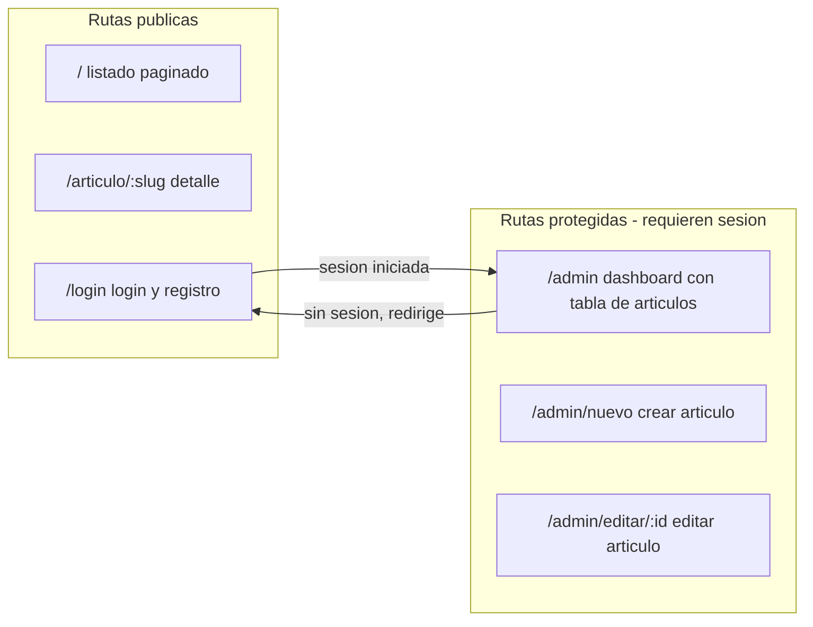

# Blog de videojuegos con React y Supabase

## Estado actual

- Supabase **BlogVideojuegosMasterCursor** (`isylttlfupuwztdjpyfw`) ya activo, con la tabla `public.articles` y sus políticas RLS ya aplicadas (migración `create_articles_table`). No hace falta tocar el esquema.
- Diseño completo en [design/stitch-portal-de-videojuegos-administrable](design/stitch-portal-de-videojuegos-administrable): 5 pantallas HTML + [gamerpulse.css](design/stitch-portal-de-videojuegos-administrable/assets/css/gamerpulse.css) (CSS nativo, BEM, base 10px) + `DESIGN.md` (paleta Neon-Slate, tipografía Sora).
- No existe todavía el proyecto React: se crea desde cero en la raíz del workspace.

## Decisiones

- **Vite + React (JavaScript, no TS)** con JSDoc según `skill-javascript`, banners según `skill-format-comment-code`.
- **Sin react-router** (regla "no dependencias externas"): enrutador propio ligero con History API (contexto `RouterContext` + componente `Enlace` + función `navegar`). Dependencias finales: `react`, `react-dom`, `@supabase/supabase-js` (+ Vite/plugin-react como dev).
- **Auth**: email + contraseña de Supabase (login y registro). Confirmación por email según config por defecto del proyecto; se verificará y ajustará si bloquea el flujo del curso.
- **CSS**: adaptar `gamerpulse.css` del diseño a hojas propias por componente/página, BEM estricto, `font-size` base 10px, rem, flexbox/grid, responsive. Todos los textos en español.
- Feedback visual en DOM (toasts/modales con estilos de la web), nunca `alert/confirm/prompt`; modal de confirmación propio para eliminar artículos.

## Rutas y protección



- `RutaProtegida`: si no hay sesión redirige a `/login`; si el usuario logueado visita `/login` redirige a `/admin`.
- Home: listado de artículos publicados, paginado con `range()` de Supabase (6 por página) y controles de paginación.
- Dashboard: tabla con todos los artículos del autor, acciones editar / eliminar (con modal de confirmación) / publicar-despublicar (toggle).
- Editor: formulario para crear/editar (título, extracto, contenido, URL de imagen, estado publicado); genera `slug` a partir del título.

## Estructura de archivos prevista

```
index.html
vite.config.js
package.json
.env  (generado con la anon key vía MCP; ya está en .gitignore)
src/
  main.jsx
  App.jsx
  lib/supabase.js          (cliente Supabase con variables VITE_*)
  router/                  (enrutador propio: contexto, Enlace, rutas)
  context/AuthContext.jsx  (sesión, login, registro, logout)
  components/              (Cabecera, PiePagina, TarjetaArticulo, Paginacion, Modal, Toast, RutaProtegida...)
  pages/                   (Home, DetalleArticulo, Login, AdminDashboard, AdminEditor)
  services/articulos.js    (CRUD y consultas paginadas a la tabla articles)
  styles/                  (base + un css por bloque BEM, adaptado del diseño)
types/  y  jsconfig.json   (según skill-javascript)
```

## Integración Supabase (vía MCP)

- Obtener la **anon key** con `get_publishable_keys` y escribir `.env` real (la URL ya está en [.env.example](.env.example)).
- Verificar con `get_advisors` que no haya avisos de seguridad tras el desarrollo.
- El servicio `articulos.js` usará: select paginado con filtro `published=true` (público), select por slug, y CRUD completo autenticado (insert con `author_id = auth.uid()`, update, delete, toggle de `published`).

## Verificación final

- Levantar `npm run dev`, probar registro/login, crear/editar/publicar/despublicar/eliminar artículos, paginación pública y protección de rutas.
- README con instrucciones de instalación y arranque.